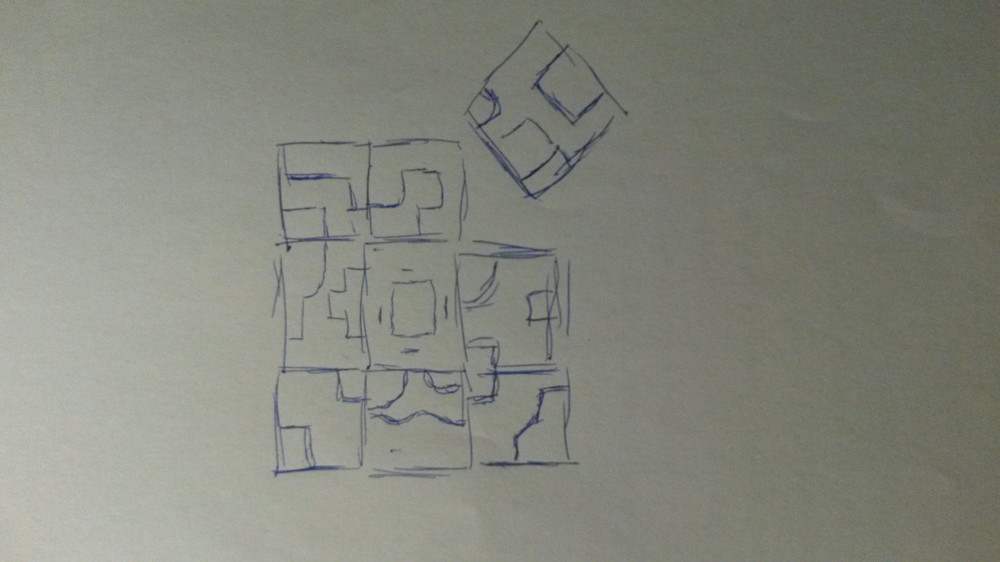

%1.6: Drawing
%Rushi Shah
%1 January 2012

#Q

Draw the building. Try to capture something significant and say what that is.

#A

I tried to capture the structure and order of the grid structure of the building. This symmetry of the 9 box grid offset at the ninth location is important to the Rajasthani culture, which I tried to reproduce here. 

